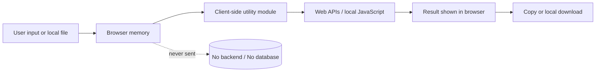
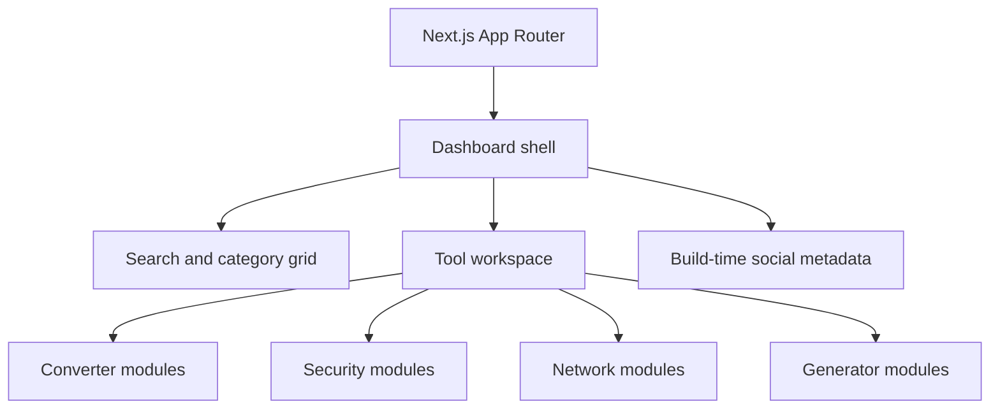

# DevKitCircle

> A privacy-first Swiss Army knife for developers and DevSecOps, built by **CollabCircle**.

DevKitCircle brings common conversion, security, formatting, networking, and generation utilities into one fast browser workspace. Every transformation runs on the user’s device. Tool inputs are never uploaded, stored, proxied, or analyzed.

## Privacy architecture



- **100% client-side:** conversions, parsing, formatting, generation, and hashing execute in browser JavaScript.
- **Zero tool-data transmission:** there are no API routes, server actions, databases, analytics, or external processing services.
- **Local files stay local:** uploaded files are read into browser memory and are never transmitted.
- **Native cryptography:** SHA-1, SHA-256, and SHA-512 use `crypto.subtle`; UUIDs use secure native random values.
- **Offline MD5:** provided for compatibility via local JavaScript. MD5 and SHA-1 are not appropriate for modern security guarantees.
- **Self-hosted fonts:** font assets ship with the app, avoiding runtime font-provider requests.

JWT contents are decoded, not signature-verified. Decoding does not prove that a token is authentic.

## Features

| Category          | Utilities                                                                                              |
| ----------------- | ------------------------------------------------------------------------------------------------------ |
| Converters        | JSON/YAML/TOML, ENV, CSV/Markdown, timestamps, PNG/JPEG/JFIF/WebP/SVG/GIF images, gzip/deflate/ZIP     |
| Security & Hashes | Base64/URL/HTML, JWT, hashes, binary encodings, HMAC, AES-GCM, PKCE, SRI, RSA/ECDSA and PEM inspection |
| Formatters        | JSON/SQL formatting and regex inspection                                                               |
| Network           | CURL conversion, URL parsing, HTTP statuses, IPv4/CIDR calculation                                     |
| Generators        | UUID/ULID, colors, WCAG contrast, cron, mock records, QR codes and Linux permissions                   |
| Data & Text       | Text/JSON diff, JSON Schema, case/line/base tools, structured data and transformation pipelines        |
| Knowledge         | Searchable web, Unicode/entity, Git, Docker, Kubernetes and ENV references                             |

Product features include favorites, recent tools, direct `?tool=` links, `Ctrl/Cmd+K` search focus, persistent light/dark themes, locally saved pipeline recipes, local-data clearing, lazy-loaded workspaces, and installable PWA/offline support.

Reference datasets are bundled with the application. DevKitCircle deliberately excludes live DNS, WHOIS, public-IP, remote API testing, reputation scanning, breach lookup and other features that would transmit user input.

## Application structure



```text
src/
├── app/                 # Routes, metadata, global theme
├── components/          # Dashboard and reusable tool controls
├── data/                # Tool catalog and categories
├── lib/                 # Conversion, security, network, generator logic
└── types.ts             # Shared domain types
```

## Local development

Requires Node.js 20.9 or newer and npm.

```bash
git clone https://github.com/CollabCircle-Official/DevKitCircle.git
cd DevKitCircle
npm install
cp .env.example .env
npm run dev
```

Open [http://localhost:3000](http://localhost:3000).

### Social links

The footer reads these exact environment names and exposes only their public URL values to the client bundle:

```dotenv
Linkedin=https://linkedin.com/company/your-company
Facebook=https://facebook.com/your-company
X=https://x.com/your-company
Instagram=https://instagram.com/your-company
YouTube=https://youtube.com/@your-company
Website=https://your-company.com
```

`.env` is ignored by Git. Never place secrets in these fields: social URLs become public build metadata.

## Quality checks

```bash
npm run typecheck
npm run lint
npm run build
```

## Browser support and deployment

Current Chrome, Edge, Firefox, and Safari releases are supported. Clipboard, Web Crypto, service-worker, and install features require HTTPS or localhost. Deploy to any Next.js-compatible host; no application backend or database is needed. Rebuild after changing social links.

DevKitCircle contains no analytics or telemetry. Favorites, recents, theme preferences, and saved recipes use browser-local storage only and can be erased from the footer.

## Contributing

Keep operations deterministic and browser-only. Put transformation logic in `src/lib` and interface composition in `src/components`. New tools must not transmit user input. Run all quality checks before opening a pull request.

## License

Released under the [MIT License](LICENSE).
