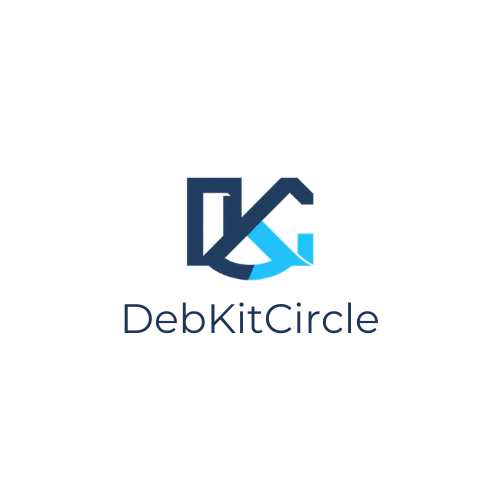
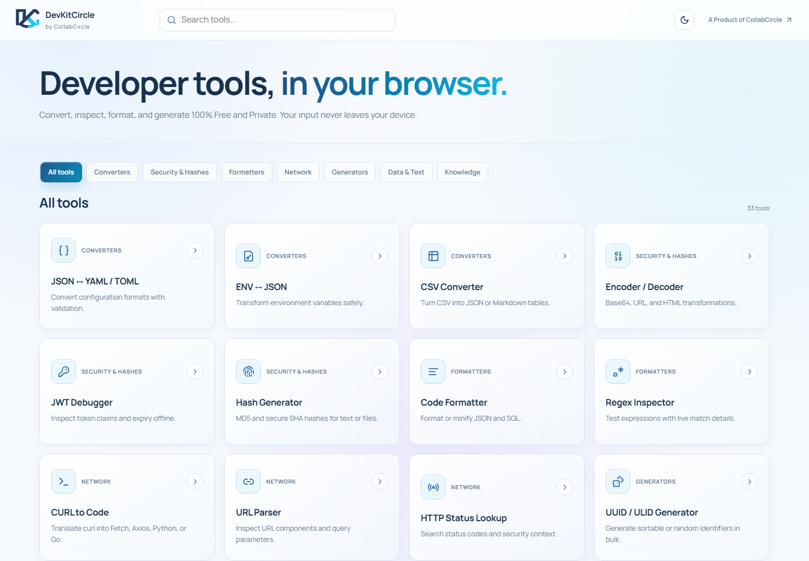
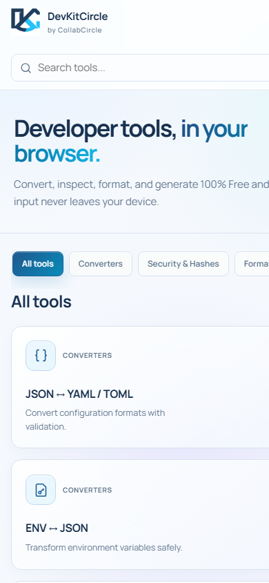
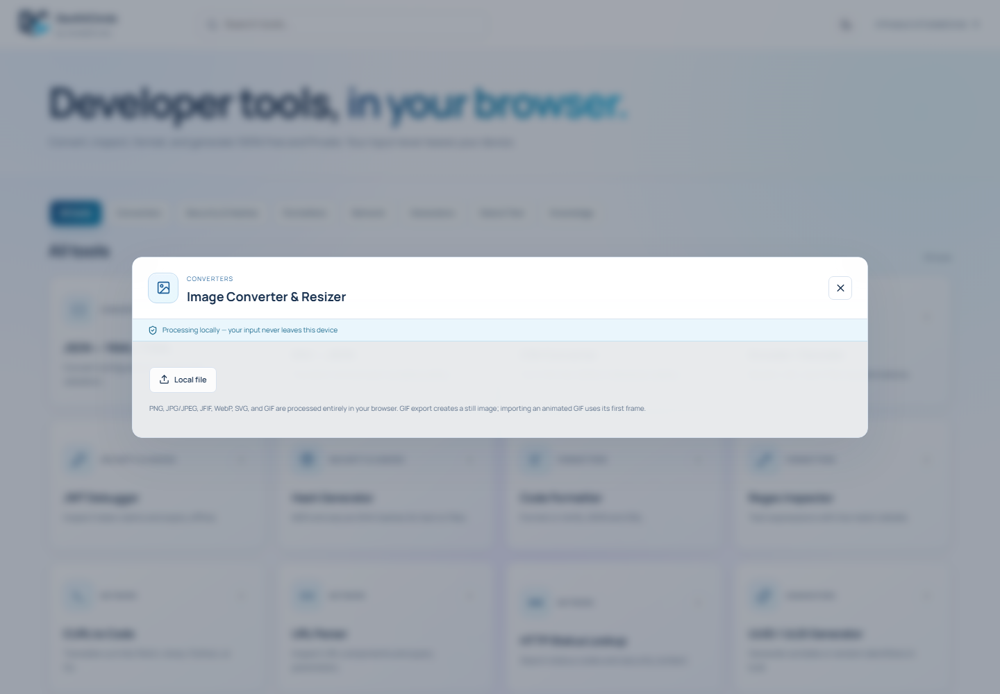
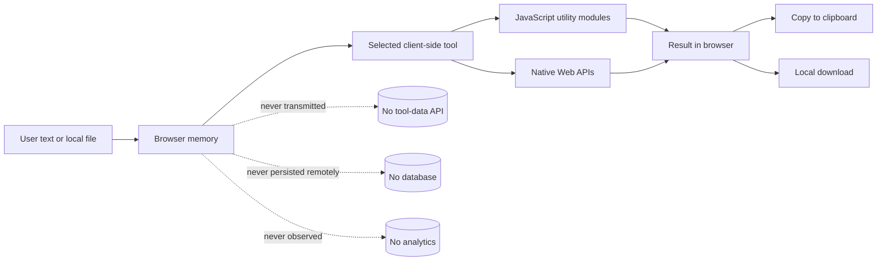
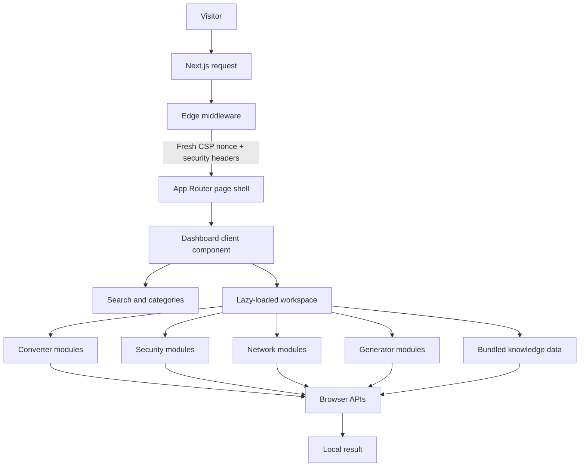
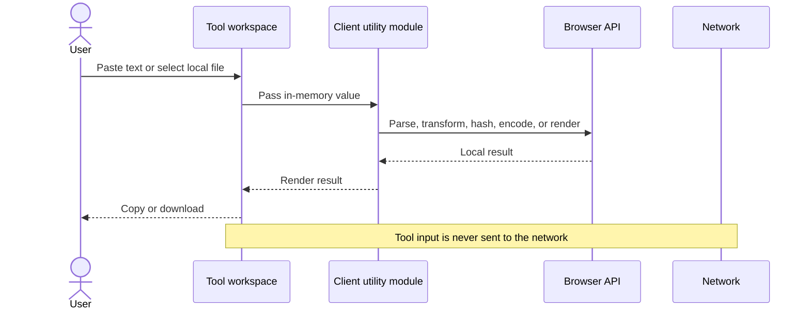
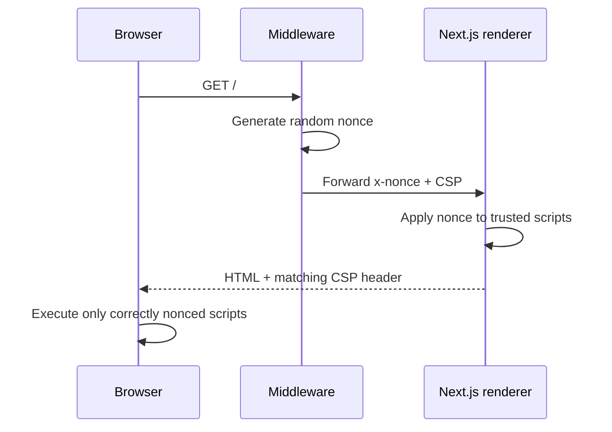

<p align="center">
  
</p>

<h1 align="center">DevKitCircle</h1>

<p align="center">
  <strong>Private developer tools that run in your browser.</strong><br />
  A flagship developer-productivity product by <strong>CollabCircle</strong>.
</p>

<p align="center">
  33 browser-based utilities · No tool-data uploads · No database · No analytics · Responsive PWA
</p>

---

DevKitCircle is a privacy-first Swiss Army knife for developers, system administrators, security engineers, technical writers, and DevOps teams. It combines format conversion, encoding, cryptography, code formatting, network inspection, data generation, image conversion, and searchable technical reference books in one responsive workspace.

All user-provided text, tokens, configuration, code, and files are processed locally in browser memory. DevKitCircle has no application-data API, database, analytics SDK, telemetry pipeline, upload service, or remote transformation provider.

> [!IMPORTANT]
> The HTML application shell is rendered per request so Next.js can attach a fresh Content Security Policy nonce. Tool inputs and transformations remain client-side and are never included in that request.

## Product preview

### Desktop dashboard



### Responsive views

<table>
  <tr>
    <th width="34%">Mobile dashboard</th>
    <th width="66%">Tool workspace</th>
  </tr>
  <tr>
    <td valign="top">
      
    </td>
    <td valign="top">
      
    </td>
  </tr>
</table>

## Why DevKitCircle

Many online developer utilities require pasting credentials, JWTs, environment variables, production payloads, customer data, or internal configuration into an unknown server. DevKitCircle is designed around a different boundary: the browser is the processing environment.

| Principle | Implementation |
| --- | --- |
| Local by default | Transformations execute in client-side JavaScript and browser Web APIs. |
| No tool-data backend | There are no API routes, server actions, upload endpoints, processing queues, or databases. |
| No behavioral tracking | No analytics, telemetry, advertising, session replay, or third-party runtime scripts. |
| Transparent storage | Only theme, recent tools, and optional pipeline recipes use `localStorage`; users can clear them from the footer. |
| Self-contained UI | Fonts, icons, reference datasets, status codes, and application assets ship with the project. |
| Defense in depth | Per-request CSP nonces, restrictive response headers, URL validation, SVG checks, and safe service-worker caching. |

## Privacy architecture



### What crosses the network boundary

| Data | Transmitted? | Explanation |
| --- | ---: | --- |
| Page request | Yes | Loads the application shell and locally hosted static assets. |
| CSP nonce | Response only | A random nonce is generated for each document response and attached to trusted framework scripts. |
| Tool text input | No | Remains in React state and browser memory. |
| Uploaded files | No | Read through browser file APIs and processed locally. |
| JWTs, environment values, keys | No | Parsed or transformed locally; never sent to an API. |
| Generated output | No | Displayed, copied, or downloaded locally. |
| Theme and recent tools | No | Stored in the browser's `localStorage`. |
| Social-link navigation | Only when clicked | Opens the configured external destination in a separate protected tab. |

## Complete feature catalog

### Converters

| Tool | Capabilities |
| --- | --- |
| JSON ↔ YAML / TOML | Bidirectional configuration conversion, parsing, validation, and readable errors. |
| ENV ↔ JSON | Converts environment-variable files into structured JSON and back. |
| CSV Converter | Converts CSV text or local files into JSON arrays or Markdown tables. |
| Date & Timestamp | Converts Unix timestamps, ISO dates, UTC values, local time, and relative dates. |
| Image Converter & Resizer | Converts PNG, JPG/JPEG, JFIF, WebP, SVG, and GIF with custom dimensions, aspect locking, scale presets, quality, preview, and local download. |
| Compression Lab | Compresses and decompresses gzip, deflate, and ZIP content locally. |

### Security and hashes

| Tool | Capabilities |
| --- | --- |
| Encoder / Decoder | Base64, URL, and HTML entity encoding and decoding. |
| JWT Debugger | Decodes JWT headers and payloads and displays expiration details without contacting an identity provider. |
| Hash Generator | MD5, SHA-1, SHA-256, and SHA-512 hashing for text and local files. |
| Security Headers | Inspects pasted response headers and provides CSP/security-header guidance. |
| Encoding & Binary Lab | HEX, binary, Base32, Base58, ROT13, and Unicode escape transformations. |
| Crypto & Key Lab | Random secrets, HMAC, AES-GCM, PKCE, SRI, RSA/ECDSA key generation, JWK output, and PEM inspection. |

### Formatters

| Tool | Capabilities |
| --- | --- |
| Code Formatter | Formats and minifies JSON and SQL. |
| Regex Inspector | Tests regular expressions in real time and displays match details. |

### Network tools

| Tool | Capabilities |
| --- | --- |
| CURL to Code | Converts cURL commands into Fetch, Axios, Python Requests, or Go code. |
| URL Parser | Splits URLs into protocol, host, port, path, fragments, and query parameters. |
| HTTP Status Lookup | Searches an offline status-code catalog with security context. |
| IP & CIDR Toolkit | Validates IPv4 addresses and calculates network, broadcast, mask, wildcard, host range, and address count. |

### Generators

| Tool | Capabilities |
| --- | --- |
| UUID / ULID Generator | Produces random UUID v4 and sortable ULIDs in bulk. |
| Color & Contrast | Converts HEX, RGB, and HSL colors and evaluates WCAG contrast. |
| HEX Color Library | Searches and copies 216 web-safe colors. |
| Cron Builder | Builds and explains standard five-field cron expressions. |
| Mock Data Generator | Produces repeatable JSON, CSV, and SQL records from a local seed. |
| QR Code Toolkit | Generates and decodes QR codes, including Wi-Fi and contact payloads. |
| Permissions Calculator | Converts symbolic and octal Linux file permissions. |

### Data and text

| Tool | Capabilities |
| --- | --- |
| Text & JSON Diff | Compares text or structured JSON and highlights additions and removals. |
| JSON Schema Toolkit | Validates JSON with Ajv and infers starter schemas. |
| Text Workbench | Case conversion, slug generation, sorting, deduplication, reversal, number bases, semantic-version comparison, package-name checks, Lorem Ipsum, and text statistics. |
| Structured Data Lab | JSON flattening/unflattening, deterministic sorting, XML, dot paths, XPath, Markdown conversion, and basic code formatting. |
| Transformation Pipeline | Chains local text and encoding operations and saves recipes in browser storage. |

### Knowledge books

| Tool | Capabilities |
| --- | --- |
| Unicode & Entity Book | Explores Unicode code points, emoji, escapes, and HTML entities. |
| Web Reference Book | Searches bundled HTTP-header, MIME-type, port, and regular-expression references. |
| DevOps Reference | Searches bundled Git, Docker, Kubernetes, and environment-variable references. |

## Image conversion details

The image converter accepts PNG, JPG, JPEG, JFIF, WebP, SVG, and GIF files. Users can set width and height independently, lock the original aspect ratio, use 25–200% resolution presets, choose output quality, and select a background color when exporting transparent artwork to JPEG/JFIF.

| Behavior | Detail |
| --- | --- |
| Processing | Canvas, `createImageBitmap`, Blob URLs, and the local `gifenc` encoder. |
| Metadata | Re-encoding strips embedded metadata from exported images. |
| Safety limit | Output is capped at 40 megapixels to protect browser memory. |
| GIF | Animated GIF input uses the first frame; GIF export creates a still GIF. |
| SVG input | Scripts, event handlers, and external resource references are rejected before decoding. |
| SVG output | Raster output is embedded in an SVG wrapper; bitmap artwork is not vectorized. |
| Transparency | Preserved by PNG/WebP/SVG where supported; JPEG/JFIF uses the selected background. |

## Runtime architecture



### Tool execution sequence



## Security model

### Strict Content Security Policy

Every document request receives a cryptographically random nonce. Middleware supplies the nonce to the request and response; Next.js automatically adds it to framework, page, and hydration scripts.



The production script policy contains a per-request `'nonce-…'` and `'strict-dynamic'`. It does not contain script `'unsafe-inline'` or `'unsafe-eval'`. Development adds `'unsafe-eval'` only because the Next.js development runtime requires it.

### Response-header controls

| Header/control | Policy |
| --- | --- |
| Content-Security-Policy | Nonce-based scripts, `strict-dynamic`, no script attributes, restricted resources, no framing/plugins. |
| Strict-Transport-Security | Two years, subdomains, preload. |
| X-Content-Type-Options | `nosniff`. |
| X-Frame-Options | `DENY` for legacy clickjacking protection. |
| Referrer-Policy | `no-referrer`. |
| Permissions-Policy | Camera, microphone, location, payment, USB, sensors, and unrelated browser capabilities disabled. |
| Cross-Origin-Opener-Policy | `same-origin`. |
| Cross-Origin-Embedder-Policy | `require-corp`. |
| Cross-Origin-Resource-Policy | `same-origin`. |
| Origin-Agent-Cluster | Enabled. |
| X-DNS-Prefetch-Control | Disabled. |
| X-Permitted-Cross-Domain-Policies | Disabled. |
| X-Powered-By | Disabled in Next.js. |
| Platform disclosure | Vercel transforms delete `Server` and related `x-vercel-*` response headers. |

### Additional application safeguards

- Public social URLs are accepted only when they use `http:` or `https:`.
- External links use `noopener noreferrer`.
- React renders user text without raw HTML injection sinks.
- SVG input rejects scripts, event handlers, JavaScript URLs, and external resources.
- Image output dimensions are bounded to prevent accidental memory exhaustion.
- The service worker caches only successful, same-origin, non-document responses.
- Nonce-bearing HTML is never stored by the service worker.
- Missing scripts and assets never fall back to an HTML response.
- Production dependencies are audited with npm.

### Cryptographic notes

- SHA-1, SHA-256, and SHA-512 use the native Web Crypto API.
- AES-GCM, HMAC, PKCE, RSA/ECDSA, and secure random values use browser cryptographic primitives.
- MD5 is provided only for compatibility and must not be used for password storage or modern integrity guarantees.
- SHA-1 is retained for legacy compatibility and is not collision-resistant for modern security use.
- JWT decoding does not verify a signature and therefore does not prove authenticity.

## Key engineering decisions

| Decision | Reason | Trade-off |
| --- | --- | --- |
| Client-only tool execution | Protects credentials, code, files, and payloads from third-party processing. | Some tools that inherently require remote network data are intentionally excluded. |
| Per-request CSP nonce | Removes unrestricted inline-script execution and satisfies strict CSP requirements. | The HTML shell is dynamically rendered and cannot be CDN-cached as a static document. |
| No document caching in the service worker | Prevents reuse of stale nonce-bearing HTML. | The application requires a network response to open a new document session. |
| Lazy-loaded tool workspace | Keeps the initial dashboard bundle small while supporting many tools. | The first opening of a tool may require loading an additional same-origin chunk. |
| Bundled reference datasets | Preserves privacy and offline lookup behavior after assets are loaded. | Reference data changes require a new application release. |
| Self-hosted fonts | Avoids runtime requests to font providers. | Font files contribute to the deployment size. |
| Separate `.next` and `.next-dev` directories | Prevents production builds from corrupting an active development module graph. | Two generated cache directories may exist locally. |
| Vercel header transforms | Reduces passive hosting-platform fingerprinting. | The behavior applies only after deployment on Vercel. |

## User experience

### Navigation and discovery

- Global search across names, descriptions, and tags.
- Horizontally scrollable category navigation on narrow screens.
- Recent-tool shortcuts stored locally.
- Direct links through `?tool=<tool-id>`.
- `Ctrl+K` or `Cmd+K` focuses search.
- `Escape` closes the active workspace.
- Light and dark themes persist locally.

### Responsive behavior

| Viewport | Layout behavior |
| --- | --- |
| Large desktop | Four-column adaptive tool grid and centered modal workspaces. |
| Tablet/small desktop | Two-column grid with compact header spacing. |
| Mobile | Single-column cards, scrollable category tabs, full-height workspaces, and stacked controls. |

### Accessibility considerations

- Semantic buttons and labels are used for interactive controls.
- Cards expose descriptive accessible names.
- Keyboard-visible focus rings are provided.
- Status and error messages use readable semantic colors.
- Color tools calculate WCAG contrast outcomes.
- Reduced-motion preferences disable transitions and smooth scrolling.
- Responsive type and spacing remain usable at narrow widths.

## Technology stack

| Layer | Technology |
| --- | --- |
| Application | Next.js 15 App Router and React 19 |
| Language | TypeScript |
| Styling | Hand-authored responsive CSS with light/dark design tokens and glass surfaces |
| Interface icons | Lucide React |
| Interface typeface | Manrope, self-hosted |
| Code typeface | JetBrains Mono, self-hosted |
| Structured formats | js-yaml, `@iarna/toml`, Papa Parse |
| Formatting | sql-formatter |
| Validation | Ajv |
| Compression | fflate |
| QR | qrcode and jsQR |
| GIF encoding | gifenc |
| Hash compatibility | js-md5 plus native Web Crypto for SHA algorithms |
| Deployment security | Next.js middleware, nonce CSP, response headers, Vercel transforms |

## Project structure

```text
DevKitCircle/
├── docs/
│   └── images/                     # README screenshots
├── public/
│   ├── devkitcircle-logo.png       # Product logo and PWA icon
│   └── sw.js                       # Same-origin asset service worker
├── src/
│   ├── app/
│   │   ├── globals.css             # Theme, layout, cards, tools, responsive UI
│   │   ├── layout.tsx              # Metadata, local fonts, root document
│   │   ├── manifest.ts             # PWA manifest
│   │   └── page.tsx                # Nonce-compatible dynamic page shell
│   ├── components/
│   │   ├── Dashboard.tsx           # Header, search, categories, cards, modal, footer
│   │   ├── ExtendedWorkspace.tsx   # Extended tool-suite interfaces
│   │   ├── ServiceWorker.tsx       # Production service-worker registration
│   │   ├── ToolUI.tsx              # Reusable editors, selectors, copy/file controls
│   │   └── ToolWorkspace.tsx       # Core tool interfaces
│   ├── data/
│   │   ├── references.ts           # Bundled searchable reference entries
│   │   └── tools.ts                # Tool metadata, categories, descriptions, tags
│   ├── lib/
│   │   ├── common.ts               # Shared browser helpers
│   │   ├── converters.ts           # Config, ENV, and CSV conversion logic
│   │   ├── extended.ts             # Extended transformations and generators
│   │   ├── generators.ts           # UUID, ULID, and color helpers
│   │   ├── network.ts              # cURL, URL, and status-code utilities
│   │   └── security.ts             # Encoding, JWT, and hashing logic
│   ├── gifenc.d.ts                 # Local GIF encoder declarations
│   ├── middleware.ts               # CSP nonce generation and response policy
│   └── types.ts                    # Shared tool/category types
├── .env.example                    # Public social URL template
├── .gitignore
├── eslint.config.mjs
├── next.config.ts                  # Headers, public environment mapping, build config
├── package.json
├── tsconfig.json
└── vercel.json                     # Platform response-header transforms
```

## Getting started

### Requirements

- Node.js 20.9 or newer
- npm
- A current version of Chrome, Edge, Firefox, or Safari

### Installation

```bash
git clone https://github.com/CollabCircle-Official/DevKitCircle.git
cd DevKitCircle
npm install
```

Create the local environment file.

macOS/Linux:

```bash
cp .env.example .env
```

Windows PowerShell:

```powershell
Copy-Item .env.example .env
```

Start development:

```bash
npm run dev
```

Open [http://localhost:3000](http://localhost:3000).

## Environment variables

The header and footer social destinations are supplied at build time using these exact root `.env` keys:

```dotenv
Linkedin=https://linkedin.com/company/your-company
Facebook=https://facebook.com/your-company
X=https://x.com/your-company
Instagram=https://instagram.com/your-company
YouTube=https://youtube.com/@your-company
Website=https://your-company.com
```

| Variable | Used for |
| --- | --- |
| `Linkedin` | LinkedIn footer link |
| `Facebook` | Facebook footer link |
| `X` | X/Twitter footer link |
| `Instagram` | Instagram footer link |
| `YouTube` | YouTube footer link |
| `Website` | CollabCircle product link and website footer link |

These values are exposed as public build metadata and validated as HTTP(S) URLs. Never place secrets, API keys, passwords, tokens, or private endpoints in them. `.env` is excluded from Git.

## Available commands

| Command | Purpose |
| --- | --- |
| `npm run dev` | Starts the development server, normally on port 3000. |
| `npm run build` | Creates an optimized production build. |
| `npm start` | Serves the production build. |
| `npm run typecheck` | Runs TypeScript without emitting files. |
| `npm run lint` | Runs ESLint across maintained source files. |
| `npm audit --omit=dev` | Checks production dependencies for known vulnerabilities. |

Development output uses `.next-dev`; production output uses `.next`. Keeping them separate prevents `next build` from invalidating an active development server.

## Quality and security validation

Run the standard validation suite before committing:

```bash
npm run typecheck
npm run lint
npm run build
npm audit --omit=dev
```

For CSP verification, inspect a production response and confirm:

1. `script-src` contains a nonce and `'strict-dynamic'`.
2. The script policy does not contain `'unsafe-inline'` or `'unsafe-eval'`.
3. Every rendered `<script>` has the nonce from the response policy.
4. A second document request receives a different nonce.

## Deployment

### Vercel

1. Import the GitHub repository into Vercel.
2. Add the six social environment variables.
3. Use the default Next.js build command: `npm run build`.
4. Deploy and verify the production response headers.
5. Rescan the final production URL after each security-policy change.

`vercel.json` removes platform-identifying response headers. These transforms cannot be verified through `next start`; they run only on Vercel after deployment.

### Other Next.js hosts

The application can run on another Next.js-compatible platform that supports middleware and dynamic App Router pages. Recreate the `vercel.json` header-removal behavior at the hosting proxy if technology-disclosure suppression is required.

### Hosting constraints

- Middleware/edge execution is required for per-request nonces.
- Pure static export is incompatible with the current strict nonce policy.
- HTTPS is required in production for Web Crypto, clipboard, PWA, service-worker, and HSTS behavior.
- The site does not require an application database or tool-processing API.

## PWA and caching behavior

DevKitCircle includes an installable manifest and a small same-origin service worker. Successful local assets may be cached, but HTML documents are deliberately excluded because they contain request-specific CSP nonces. The service worker uses network-first behavior and returns an error instead of substituting HTML for a missing JavaScript or CSS asset.

## Browser compatibility

Current stable releases of Chrome, Edge, Firefox, and Safari are targeted. A tool may show a browser-level error when a required format decoder or Web API is unavailable. Cryptographic key support, image codecs, clipboard permissions, and PWA installation behavior can vary slightly by browser and operating system.

## Intentionally excluded tools

The following categories conflict with the zero-tool-data-transmission promise and are not included:

- Live DNS and WHOIS queries
- Public IP detection
- Remote HTTP/API execution
- Webhook testing
- External URL screenshotting
- Reputation or malware scanning
- Breach and credential lookup
- Cloud format conversion
- Server-side image or document processing

Adding one of these would require a clearly separated product boundary, explicit consent, and revised privacy claims.

## Contributing

1. Keep every tool transformation client-side.
2. Do not add analytics, telemetry, remote fonts, or third-party runtime scripts.
3. Put reusable processing logic in `src/lib`.
4. Put tool metadata and search tags in `src/data/tools.ts`.
5. Build interfaces from shared controls in `src/components/ToolUI.tsx`.
6. Validate uploaded content and bound memory-intensive operations.
7. Preserve keyboard access, responsive layouts, dark mode, and reduced-motion support.
8. Document limitations instead of implying security guarantees a tool cannot provide.
9. Run type checking, linting, the production build, and the dependency audit.

## Brand

DevKitCircle uses the official navy-and-cyan CollabCircle product identity. The interface extends those colors through restrained blue/cyan accents, pale atmospheric backgrounds, accessible text contrast, Manrope interface typography, and JetBrains Mono code typography.

The logo source used by the application is [`public/devkitcircle-logo.png`](./public/devkitcircle-logo.png).

## License

Released under the [MIT License](./LICENSE).

---

<p align="center">
  <strong>DevKitCircle</strong> · A product of CollabCircle<br />
  Built for fast, private, everyday developer work.
</p>
